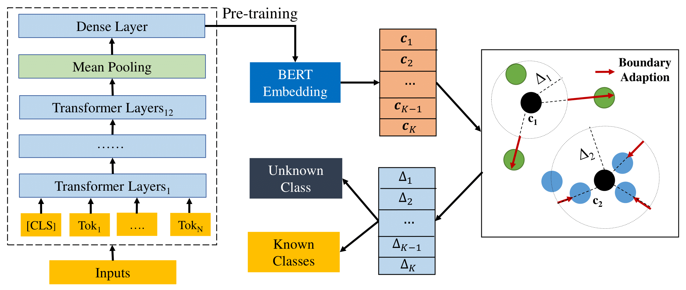

# Deep Open Intent Classification with Adaptive Decision Boundary

A method to automatically learn the decision boundary for open world classification.

## Introduction
This repository provides the PyTorch implementation of the research paper [Deep Open Intent Classification with Adaptive Decision Boundary](**Accepted by [AAAI2021](https://aaai.org/Conferences/AAAI-21/)**).

## Usage
Install all required library
```
pip install -r requirements.txt
```
Get the pre-trained [BERT](https://storage.googleapis.com/bert_models/2018_10_18/uncased_L-12_H-768_A-12.zip) model and convert it into [Pytorch](https://huggingface.co/transformers/converting_tensorflow_models.html) 

Run the experiments by: 
```
python run_all.py
```

Selected Parameters
```
task_name: clinc | banking | oos
known_class_ratio: 0.25 | 0.5 | 0.75 (default)
labeled_ratio: 0.2 | 0.4 | 0.6 | 0.8 | 1.0 
```
The model architecture of DeepAligned:



##  Results
### Main experiments

| Ratio | | BANKING     |  | OOS      |  |  StackOverflow     |  |  
|:-----:|:-----:|:-----:|:-----:|:-----:|:-----:|:-----:|:-----:|
|  | Methods | Accuracy | F1-score | Accuracy  |F1-score  | Accuracy | F1-score | 
|25%| MSP      |43.67| 50.09 |47.02  | 47.62 | 28.67 | 37.85 | 
|| DOC      | 56.99 | 58.03 | 74.97 | 66.37 | 42.74 |47.73 | 
|| OpenMax  | 49.94 | 54.14 | 68.50 | 61.99 | 40.28 | 45.98|  
|| DeepUnk  | 64.21 | 61.36 | 81.43 | 71.16 | 47.84 | 52.05 | 
|| ADB     | __78.85__ | __71.62__ | __87.59__ | __77.19__ | __86.72__ |__80.83__|
|50%| MSP | 59.73 | 71.18 | 62.96 | 70.41 | 52.42 | 63.01 | 
|| DOC  | 64.81 | 73.12 | 77.16 | 78.26 | 52.53  | 62.84 | 
|| OpenMax | 65.31 | 74.24 | 80.11 | 80.56 | 60.35 | 68.18 |
|| DeepUnk | 72.73 | 77.53 | 83.35 | 82.16 | 58.98 | 68.01 |
|| ADB | __78.86__ | __80.90__ | __86.54__ | __85.05__ | __86.40__ | __85.83__ |
|75% | MSP | 75.89 | 83.60 | 74.07 | 82.38 | 72.17 | 77.95 |
|| DOC | 76.77 | 83.34 | 78.73 | 83.59 | 68.91 | 75.06 |
|| OpenMax | 77.45 | 84.07 | 76.80 | 73.16 | 74.42 |79.78 |
|| DeepUnk |  78.52 | 84.31 | 83.71 | 86.23 | 72.33 | 78.28 | 
|| ADB  |  __81.08__ | __85.96__ | __86.32__ | __88.53__ | __82.78__ |__85.99__ | 

### Ablation study
| Method   |       | CLINC |       |       |BANKING|       |   
|:--------:|:-----:|:-----:|:-----:|:-----:|:-----:|:-----:|
| Method   |  NMI  |  ARI  |  ACC  |  NMI  |  ARI  |  ACC  |
| w/o Pre + Reinit      | 57.80 | 9.63 | 23.02 | 34.34 | 4.49 | 13.67 | 
| w/o Pre + Align   | 62.53 | 14.10 | 28.63 | 36.91 | 5.23 | 15.42 | 
| Pre + Reinit      | 82.90 | 45.67 | 55.80 | 68.12 | 31.56 | 41.32 | 
| Pre + Align   | __93.89__ | __79.75__ | __86.49__ | __79.56__ | __53.64__ | __64.90__ | 

This paper is to appear at the [Thirty-Fifth AAAI Conference on Artificial Intelligence](https://aaai.org/Conferences/AAAI-21/) (AAAI2021). An arXiv version is released [here](https://arxiv.org/pdf/2012.08987.pdf).

If you are instrested in this work, please **star** this repository and cite by. 
```
@article{zhang2020discovering,
      title={Discovering New Intents with Deep Aligned Clustering}, 
      author={Hanlei Zhang and Hua Xu and Ting-En Lin and Rui Lv},
      year={2020},
      journal={arXiv preprint arXiv:2012.08987},
}
```
### Acknowledgments
This paper is founded by National Natural Science Foundation of China, etc. 
