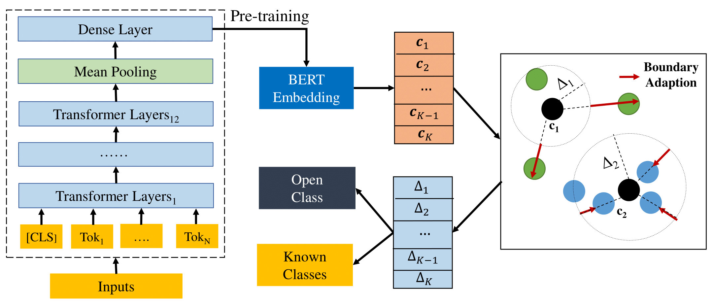

## Deep Open Intent Classification with Adaptive Decision Boundary

A method to automatically learn the adaptive decision boundary (ADB) for open world classification.

**The proposed method together with baselines are also integrated into the [open intent detection](https://github.com/thuiar/TEXTOIR/tree/main/open_intent_detection) module in our another scalable framework [TEXTOIR](https://github.com/thuiar/TEXTOIR), enjoy it!**

### Introduction
This repository provides the official PyTorch implementation of the research paper [Deep Open Intent Classification with Adaptive Decision Boundary](https://arxiv.org/pdf/2012.10209.pdf) (**Accepted by [AAAI2021](https://aaai.org/Conferences/AAAI-21/)**).

Related works can refer to the [reading list](https://github.com/thuiar/OKD-Reading-List).

### Dependencies 

We use anaconda to create python environment:
```
conda create --name python=3.6
```
Install all required libraries:
```
pip install -r requirements.txt
```

### Model Preparation

Download the pre-trained bert model (bert-base-uncased) from the following link:  
[Baidu Cloud Drive](https://pan.baidu.com/s/1k1zxK4xh0UyPhOU_-oPlow) with code: v8tk

Set the path of the uncased-bert model (parameter "bert_model" in init_parameter.py).

### Usage
Run the experiments by: 
```
sh scripts/run.sh
```
You can change the parameters in the script. The selected parameters are as follows:
```
dataset: clinc | banking | oos (default)
known_class_ratio: 0.25 | 0.5 | 0.75 (default)
labeled_ratio: 0.2 | 0.4 | 0.6 | 0.8 | 1.0 (default) 
```

### Model
The model architecture of ADB:



###  Results

The detailed results can be seen in [results.md](results/results.md).

#### Overall Performance

| | | BANKING     |  | OOS      |  |  StackOverflow     |  |  
|:-----:|:-----:|:-----:|:-----:|:-----:|:-----:|:-----:|:-----:|
| KIR* | Methods | Accuracy | F1-score | Accuracy  |F1-score  | Accuracy | F1-score | 
|25%| MSP      |43.67| 50.09 |47.02  | 47.62 | 28.67 | 37.85 | 
|| DOC      | 56.99 | 58.03 | 74.97 | 66.37 | 42.74 |47.73 | 
|| OpenMax  | 49.94 | 54.14 | 68.50 | 61.99 | 40.28 | 45.98|  
|| DeepUnk  | 64.21 | 61.36 | 81.43 | 71.16 | 47.84 | 52.05 | 
|| ADB     | __78.85__ | __71.62__ | __87.59__ | __77.19__ | __86.72__ |__80.83__|
|50%| MSP | 59.73 | 71.18 | 62.96 | 70.41 | 52.42 | 63.01 | 
|| DOC  | 64.81 | 73.12 | 77.16 | 78.26 | 52.53  | 62.84 | 
|| OpenMax | 65.31 | 74.24 | 80.11 | 80.56 | 60.35 | 68.18 |
|| DeepUnk | 72.73 | 77.53 | 83.35 | 82.16 | 58.98 | 68.01 |
|| ADB | __78.86__ | __80.90__ | __86.54__ | __85.05__ | __86.40__ | __85.83__ |
|75% | MSP | 75.89 | 83.60 | 74.07 | 82.38 | 72.17 | 77.95 |
|| DOC | 76.77 | 83.34 | 78.73 | 83.59 | 68.91 | 75.06 |
|| OpenMax | 77.45 | 84.07 | 76.80 | 73.16 | 74.42 |79.78 |
|| DeepUnk |  78.52 | 84.31 | 83.71 | 86.23 | 72.33 | 78.28 | 
|| ADB  |  __81.08__ | __85.96__ | __86.32__ | __88.53__ | __82.78__ |__85.99__ | 

*KIR means "Known Intent Ratio".

#### Fine-grained Performance

|  | | BANKING     |  | OOS      |  |  StackOverflow     |  |  
|:-----:|:-----:|:-----:|:-----:|:-----:|:-----:|:-----:|:-----:|
| KIR | Methods | Open | Known | Open | Known | Open | Known | 
|25%| MSP      |41.43| 50.55 |50.88  | 47.53 | 13.03 | 42.82 | 
|| DOC      | 61.42 | 57.85 | 81.98 | 65.96 | 41.25 |49.02 | 
|| OpenMax  | 51.32 | 54.28 | 75.76 | 61.62 | 36.41 | 47.89|  
|| DeepUnk  | 70.44 | 60.88 | 87.33 | 70.73 | 49.29 | 52.60 | 
|| ADB     | __84.56__ | __70.94__ | __91.84__ | __76.80__ | __90.88__ |__78.82__|
|50%| MSP | 41.19 | 71.97 | 57.62 | 70.58 | 23.99 | 66.91 | 
|| DOC  | 55.14 | 73.59 | 79.00 | 78.25 | 25.44  | 66.58 | 
|| OpenMax | 54.33 | 74.76 | 81.89 | 80.54 | 45.00 | 70.49 |
|| DeepUnk | 69.53 | 77.74 | 85.85 | 82.11 | 43.01 | 70.51 |
|| ADB | __78.44__ | __80.96__ | __88.65__ | __85.00__ | __87.34__ | __85.68__ |
|75%| MSP | 39.23 | 84.36 | 59.08 | 82.59 | 33.96 | 80.88 |
|| DOC | 50.60 | 83.91 | 72.87 | 83.69 | 16.76 | 78.95 |
|| OpenMax | 50.85 | 84.64 | 76.35 | 73.13 | 44.87 | 82.11 |
|| DeepUnk |  58.54 | 84.75 | 81.15 | 86.27 | 37.59 | 81.00 | 
|| ADB  |  __66.47__ | __86.29__ | __83.92__ | __88.58__ | __73.86__ |__86.80__ | 

“Open” and “Known” denote the macro f1-score over open class and known classes respectively.


If you are insterested in this work, and want to use the codes or results in this repository, please **star** this repository and **cite** by:
```
@article{Zhang_Xu_Lin_2021, 
      title={Deep Open Intent Classification with Adaptive Decision Boundary}, 
      volume={35}, 
      number={16}, 
      journal={Proceedings of the AAAI Conference on Artificial Intelligence}, 
      author={Zhang, Hanlei and Xu, Hua and Lin, Ting-En}, 
      year={2021}, 
      month={May}, 
      pages={14374-14382} 
}
```
### Acknowledgments
This paper is founded by seed fund of Tsinghua University (Department of Computer Science and Technology)- Siemens Ltd., China Joint Research Center for Industrial Intelligence and Internet of Things.
